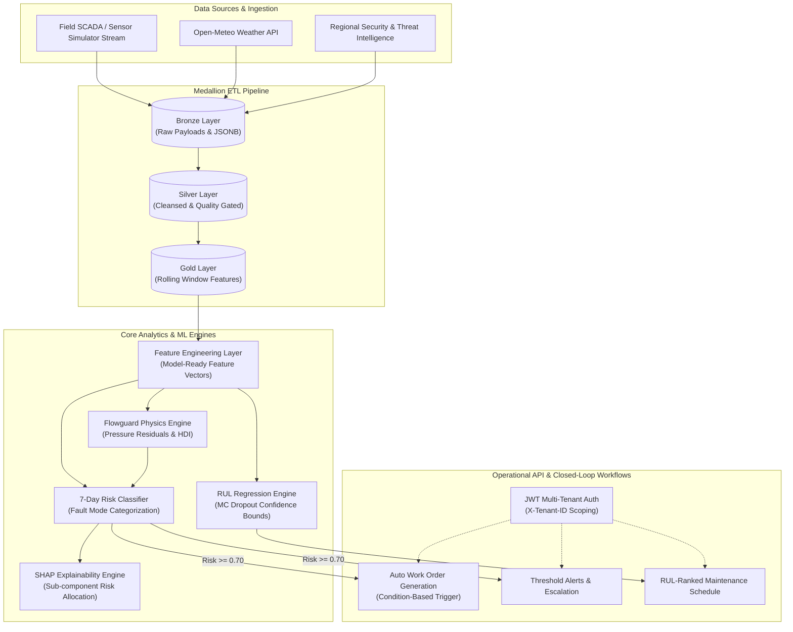
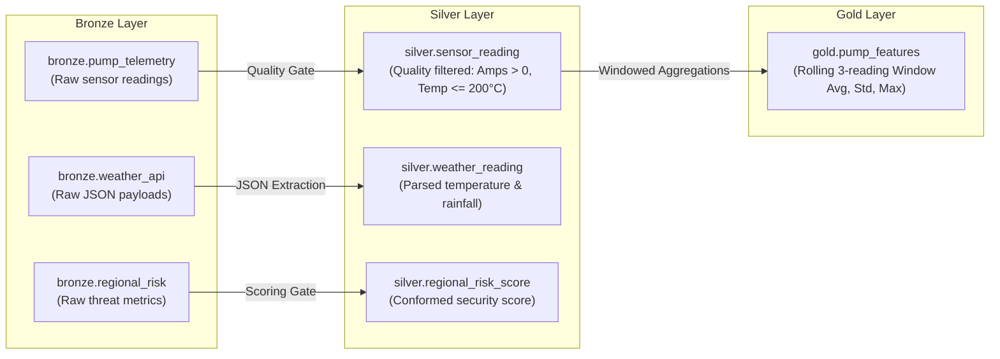
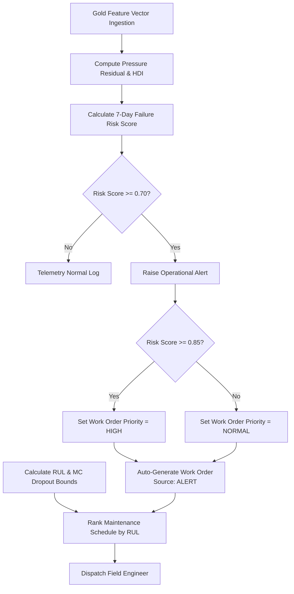
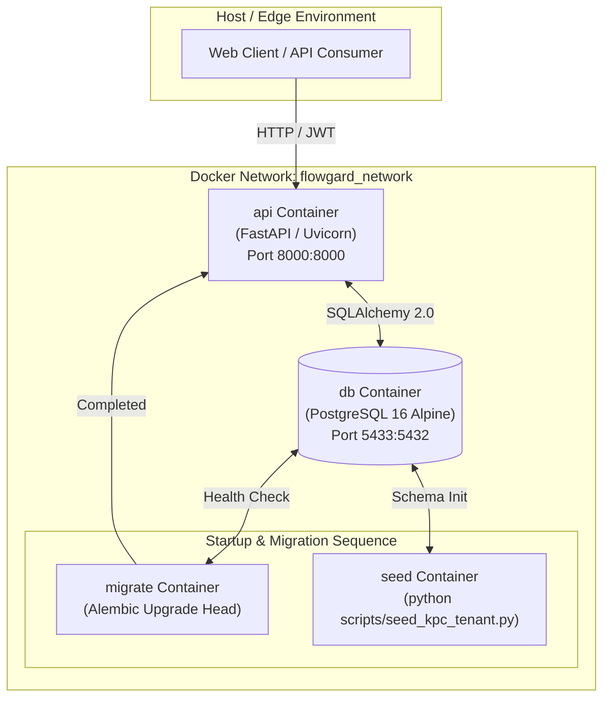

# Flowguard — Condition-Based Predictive Maintenance Platform

> **Project:** Condition-Based Predictive Maintenance for KPC Pipeline Pump Infrastructure  
> **Team:** NULL_TERMINATORS (KPC Cohort, Inuka Fellowship, Power Learn Project)  
> **Target Asset:** Kenya Pipeline Company (KPC) 1,342 km multi-product pipeline network (PS1 Mombasa to PS13 Kisumu)

---

## 1. Executive Summary & Operational Background

The **Flowguard** backend platform is a multi-tenant, condition-based predictive maintenance engine engineered for high-pressure fluid transport pipeline networks. 

### Team NULL_TERMINATORS
The team placed first in Hackathon 1 by building a revenue reconciliation pipeline addressing billing discrepancies in KPC's order-to-cash process. This capstone extends that reconciliation and data pipeline methodology to operational infrastructure: preventing unplanned pump failures across KPC's pipeline network.

| Member | Role | Key Responsibilities |
| :--- | :--- | :--- |
| **Silas Kibet** | Data Engineering Lead | Medallion pipeline (Bronze/Silver/Gold), synthetic data generation, ETL |
| **Brian Kioko** | Modelling & Machine Learning Lead | Feature engineering, HDI physics engine, 7-day risk classifier, RUL regression |
| **Ingrid Miriam** | Dashboard & Visualisation Lead | Dashboarding, stakeholder views, metric visualizations |
| **Eugene Obunde** | Storytelling & ROI Lead | Executive narrative, financial ROI, business case documentation |
| **Lameck Mugo** | QA & Documentation Lead | Testing, UAT notes, deployment readiness, security verification |

---

## 2. The Problem & Business Value

### The KPC Operational Problem
Kenya Pipeline Company (KPC) operates 1,342 kilometres of pipeline connecting Mombasa, Nairobi, Nakuru, Eldoret, and Kisumu, transporting over 14 billion litres of petroleum products annually. Traditional maintenance relies on calendar-based servicing:
1. **Unnecessary Overhauls:** Fully operational pumps are taken offline for scheduled servicing, incurring unnecessary downtime and maintenance expenditure.
2. **Undetected Degradation:** Mechanical wear (bearing friction, seal breakdown, impeller cavitation) develops between fixed maintenance intervals. Catastrophic failures have historical precedent—such as 400,000 litres lost at Thange River (2015) and 551,000 litres at Kiboko (2018), valued at over KES 63 million in product loss, environmental cleanup, and throughput stoppages.

### The Flowguard Solution & ROI
Flowguard transitions KPC to continuous, condition-driven risk mitigation:
- **Continuous Telemetry Ingestion:** Sub-minute streaming of pump vibration, temperatures, suction/discharge pressures, and electrical metrics.
- **Physics-Informed Anomaly Detection:** Real-time calculation of **Pressure Residuals** against manufacturer-rated head curves to derive a **Health Deviation Index (HDI)**.
- **7-Day Risk Classification:** ML models evaluate progressive mechanical wear to predict failures within a 7-day window and classify fault modes (`bearing_fault`, `impeller_wear`, `seal_leak`, `normal`).
- **Remaining Useful Life (RUL):** Regression models estimate remaining operational hours with Monte Carlo Dropout confidence interval bounds.
- **Explainability (XAI):** SHAP feature attributions isolate the specific sub-assembly (Bearing, Impeller, Seal, Motor) driving risk.
- **Closed-Loop Action:** Risk scores $\ge 70\%$ trigger automated condition-based work orders, while scheduled maintenance across the fleet is prioritized dynamically by RUL.

---

## 3. System Architecture & High-Level Design

Flowguard is built as a modular, multi-tenant vertical-slice backend using **FastAPI**, **SQLAlchemy 2.0**, **PostgreSQL**, and **Pydantic v2**:

- **Core Framework:** FastAPI, Pydantic v2
- **ORM & Database:** SQLAlchemy 2.0, Alembic migrations, PostgreSQL (with SQLite in-memory fallback for testing)
- **Authentication & Security:** Multi-tenant JWT auth (tenant + role claims carried in token), bcrypt password hashing, invite-only onboarding with forced first-login password reset
- **Testing & Tooling:** Pytest, pytest-cov, Ruff, `uv` / standard `venv`



### Architectural Guardrails
1. **Strict One-Way Dependency:** `routes` $\rightarrow$ `services` $\rightarrow$ `models` $\rightarrow$ `database`.
2. **Vertical Slice Architecture:** Modular domain isolation under `app/<module>/` (`models.py`, `schemas.py`, `services.py`, `routes.py`).
3. **Mandatory Multi-Tenancy:** Every tenant-scoped entity inherits `TenantScopedMixin`. Queries are forced through `get_current_tenant_id` at dependency injection, preventing cross-tenant leakage.
4. **Separation of Reference Data from Telemetry:** Telemetry flows through `app/etl` (`bronze`, `silver`, `gold`), leaving master asset tables (`station`, `pump`, `tenant`) read-only to the pipeline.
5. **Zero Secrets in Code:** Configured strictly via `app/core/config.py` from `.env`.

### Roles & Onboarding

| Role | Scope | Responsibilities |
| :--- | :--- | :--- |
| `platform_admin` | Cross-tenant (no `tenant_id`) | Seeded once (`scripts/seed_platform_admin.py`). Onboards & manages tenants; blocked from every tenant-scoped route. |
| `admin` | Single tenant | Created automatically when a tenant is onboarded. Onboards & manages that tenant's users. |
| `planner` / `technician` / `viewer` | Single tenant | Operational users invited by their tenant `admin`. |

**Onboarding flow** (identical for tenants and users): the inviter supplies an email; the system creates the account with a random first-time password and emails it via SMTP (`app/core/email.py`). On first login the account receives only a short-lived **reset token** (`POST /api/v1/users/login` → `reset_required: true`); it must call `POST /api/v1/users/reset-password` to set a real password before any access token is issued.

---

## 4. System Layout & Modules

```
app/
├── core/                   # Config, DB session factory, JWT auth, tenancy mixins
├── tenant/                 # Multi-tenant configuration & alert threshold settings
├── user/                   # User authentication & RBAC (Admin, Engineer, Operator)
├── station/                # KPC station metadata, geographic coordinates & throughput
├── pump/                   # Pump inventory, rated specifications & status tracking
├── etl/                    # Medallion ETL pipeline: bronze -> silver -> gold -> simulator
├── feature_engineering/    # Gold layer & HDI transformation into model-ready feature vectors
├── flowgard_engine/        # Pressure residual calculation & Health Deviation Index (HDI)
├── prediction/             # 7-day failure risk classifier & fault mode categorization
├── rul/                    # Remaining Useful Life regression & MC Dropout confidence bounds
├── explainability/         # SHAP feature attributions & component risk allocation
├── alert/                  # Threshold alerts & operational escalation
├── work_order/             # Condition-based maintenance work orders & auto-generation
├── maintenance_schedule/   # RUL-ranked prioritised maintenance calendar
└── model_metrics/          # Model accuracy, precision, recall & confusion matrix storage
```

---

## 5. Medallion Pipeline & Closed-Loop Workflow

### Medallion Data Pipeline Lifecycle



### Closed-Loop Operational Workflow



---

## 6. KPC Fleet Specifications (13 Stations)

Flowguard is seeded with KPC's 13 pipeline booster and depot stations from Coast to Nyanza:

| Code | Station Name | Region | County | Throughput ($\text{m}^3/\text{day}$) |
| :--- | :--- | :--- | :--- | :--- |
| **PS1** | PS1 Mombasa | Coast | Mombasa | 3,200 |
| **PS2** | PS2 Samburu | Coast | Kwale | 3,200 |
| **PS3** | PS3 Maungu | Coast | Taita Taveta | 3,200 |
| **PS4** | PS4 Mtito Andei | Eastern | Kitui | 3,200 |
| **PS5** | PS5 Konza | Eastern | Machakos | 3,200 |
| **PS6** | PS6 Nairobi Depot | Nairobi | Nairobi | 4,000 |
| **PS7** | PS7 Naivasha | Rift Valley | Nakuru | 2,600 |
| **PS8** | PS8 Gilgil | Rift Valley | Nakuru | 2,600 |
| **PS9** | PS9 Nakuru | Rift Valley | Nakuru | 2,600 |
| **PS10**| PS10 Molo | Rift Valley | Nakuru | 2,600 |
| **PS11**| PS11 Eldoret Depot | Rift Valley | Uasin Gishu | 2,600 |
| **PS12**| PS12 Turbo | Rift Valley | Uasin Gishu | 2,000 |
| **PS13**| PS13 Kisumu Depot | Nyanza | Kisumu | 2,000 |

---

## 7. Containerization & Docker Deployment

Flowguard includes full Docker support for containerized deployment across multi-container environments.

### Docker Container Topology



### Running with Docker Compose

```bash
# 1. Clone repository & configure environment
cp .env.example .env

# 2. Build and launch PostgreSQL, Database Migrations, and FastAPI Backend
docker compose up --build -d

# 3. Seed KPC anchor tenant data
docker compose --profile seed run --rm seed

# 4. View real-time container logs
docker compose logs -f api

# 5. (Optional local) Seed platform admin & KPC reference data
python scripts/seed_platform_admin.py
python scripts/seed_kpc_tenant.py
```

- **Interactive API Documentation:** `http://localhost:8000/docs`
- **Health Diagnostics:** `http://localhost:8000/health`

---

## 8. Verification & Quality Assurance

Run the automated quality and test execution script:
```bash
./scripts/check.sh
```

The script runs two verification stages:
1. **Ruff Linter & Formatter Check:** Confirms code style compliance across all modules.
2. **Pytest Suite:** Runs all unit tests covering all 13 modules.

```
======================== 64 passed, 1 warning in 7.01s =========================
=== All checks passed! Repository is healthy and ready to push. ===
```

---

## 9. Primary API Endpoints Map

| Category | Endpoint | Method | Description |
| :--- | :--- | :--- | :--- |
| **System** | `/health` | `GET` | Service status and runtime diagnostics |
| **Tenants** | `/api/v1/tenants` | `GET`, `POST` | Manage tenant configurations & thresholds |
| **Users** | `/api/v1/users/login` | `POST` | Authenticate user & issue JWT bearer token |
| **Stations** | `/api/v1/stations` | `GET`, `POST` | KPC pump station metadata |
| **Pumps** | `/api/v1/pumps` | `GET`, `POST` | Pump inventory & rated pressure specs |
| **Engine** | `/api/v1/flowgard-engine/pumps/{id}/compute` | `POST` | Calculate Pressure Residual & HDI score |
| **Predictions**| `/api/v1/predictions/pumps/{id}/trigger` | `POST` | Run 7-day failure risk classifier |
| **RUL** | `/api/v1/rul/pumps/{id}/trigger` | `POST` | Estimate Remaining Useful Life & confidence bounds |
| **XAI** | `/api/v1/explainability/pumps/{id}/trigger` | `POST` | Calculate SHAP feature attributions |
| **Alerts** | `/api/v1/alerts` | `GET`, `POST` | Active threshold alerts & resolution |
| **Work Orders**| `/api/v1/work-orders` | `GET`, `POST` | Condition-based work order tracking |
| **Schedule** | `/api/v1/maintenance-schedule/rank` | `POST` | Re-rank maintenance calendar by RUL urgency |
| **Metrics** | `/api/v1/model-metrics` | `GET`, `POST` | Historical ML model benchmark metrics |
