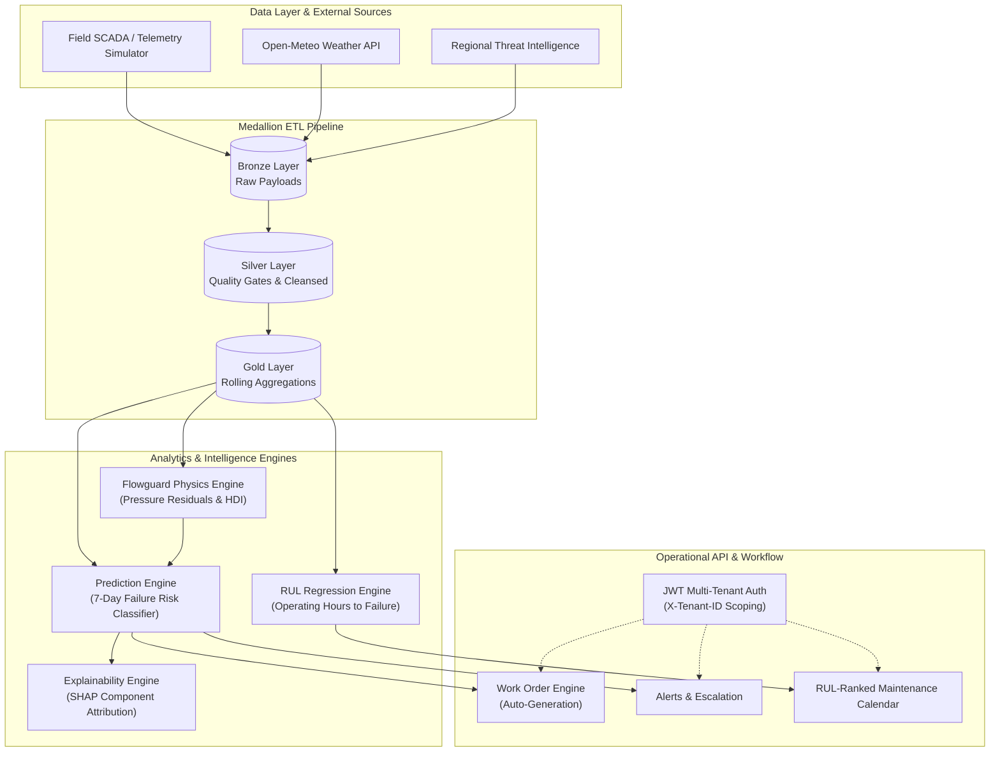
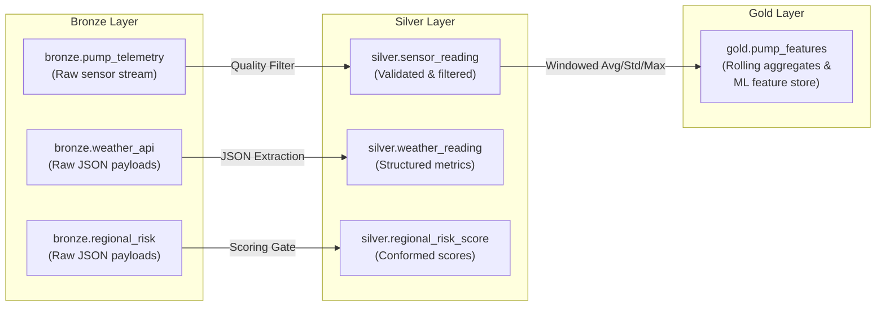
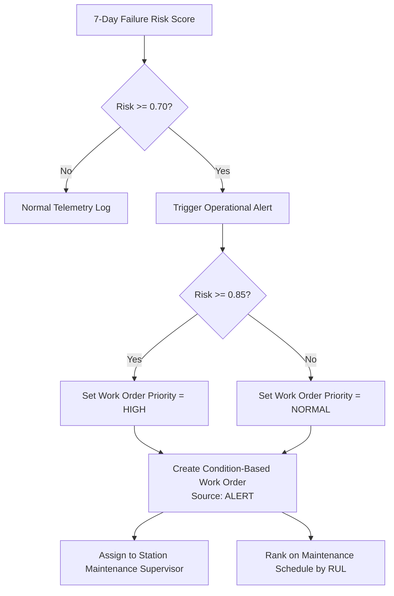
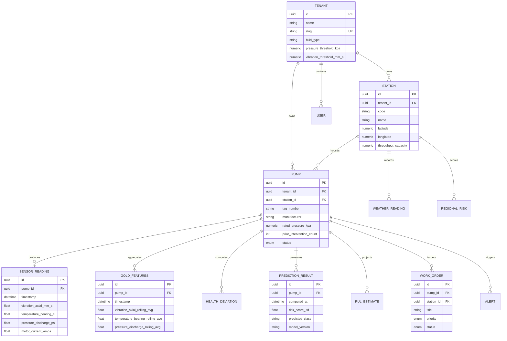

# Flowguard System & Data Architecture Documentation

> **Project:** Condition-Based Predictive Maintenance for KPC Pipeline Pump Infrastructure  
> **Team:** NULL_TERMINATORS (KPC Cohort, Inuka Fellowship, Power Learn Project)  
> **Target Asset:** Kenya Pipeline Company (KPC) 1,342 km multi-product pipeline (PS1 Mombasa to PS13 Kisumu)

---

## 1. Executive Summary & Operational Background

The **Flowguard** platform is a multi-tenant, condition-based predictive maintenance backend engineered for fluid-transport pipeline infrastructure. 

### The Problem
Kenya Pipeline Company (KPC) operates a 1,342-kilometre pipeline network moving more than 14 billion litres of petroleum products annually across high-elevation, rugged terrain. Traditional maintenance strategies rely on fixed-interval, calendar-based servicing. This paradigm creates two critical failure modes:
1. **Unnecessary Servicing:** Fully operational, healthy pumps are taken offline for scheduled overhauls, incurring unnecessary downtime and labour costs.
2. **Undetected Mechanical Degradation:** Unforeseen bearing wear, impeller cavitation, and mechanical seal degradation develop between inspection windows. Catastrophic failures have historical precedent—such as 400,000 litres lost at Thange River (2015) and 551,000 litres at Kiboko (2018), representing tens of millions of KES in product loss, environmental remediation, and pipeline downtime.

### The Flowguard Solution
Flowguard transitions KPC from reactive/calendar maintenance to continuous, condition-driven risk mitigation:
- **Continuous Telemetry Ingestion:** Sub-minute streaming of pump vibration, temperatures, suction/discharge pressures, and electrical metrics.
- **Physics-Informed Anomaly Detection:** Real-time calculation of **Pressure Residuals** against manufacturer-rated head curves to derive a **Health Deviation Index (HDI)**.
- **7-Day Risk Classification:** ML models evaluate progressive mechanical wear to predict failures within a 7-day window and classify fault modes (`bearing_fault`, `impeller_wear`, `seal_leak`, `normal`).
- **Remaining Useful Life (RUL):** Regression models estimate remaining operational hours to plan interventions before failure.
- **Explainability (XAI):** SHAP feature attributions isolate the specific sub-assembly (Bearing, Impeller, Seal, Motor) driving the risk.
- **Closed-Loop Action:** Risk scores exceeding $70\%$ trigger automated, prioritized maintenance work orders and notifications to field engineers.

---

## 2. High-Level System Architecture

Flowguard is built as a modular, vertical-slice backend in Python using **FastAPI**, **SQLAlchemy 2.0**, **PostgreSQL**, and **Pydantic v2**.



### Architectural Guardrails
1. **One-Way Dependency Graph:** `routes` $\rightarrow$ `services` $\rightarrow$ `models` $\rightarrow$ `database`. Modules never import routes from sibling modules.
2. **Vertical Slice Organisation:** Each entity lives in its own domain under `app/<module>/` (`models.py`, `schemas.py`, `services.py`, `routes.py`).
3. **Mandatory Multi-Tenancy:** All tenant-scoped entities inherit `TenantScopedMixin`. Queries are forced through `get_current_tenant_id` at dependency injection, preventing cross-tenant leakage.
4. **Separation of Reference Data from Telemetry:** Telemetry flows through `app/etl` (`bronze`, `silver`, `gold`), leaving master asset tables (`station`, `pump`, `tenant`) read-only to the pipeline.

---

## 3. Data Architecture & Telemetry Ingestion

Flowguard ingests and manages data across four distinct categories.

### 3.1 High-Frequency Pump Sensor Telemetry

Pump telemetry captures electro-mechanical variables representing pump operating state:

| Field Name | Data Type | Physical Unit | Description & Failure Mode Relevance |
| :--- | :--- | :--- | :--- |
| `timestamp` | `datetime` | ISO 8601 | Time of acquisition. |
| `pump_id` | `UUID` | Master FK | Target pump asset identifier. |
| `vibration_axial_mm_s` | `float` | $\text{mm/s}$ | Axial vibration along shaft axis; detects bearing degradation, looseness, and thrust wear. |
| `vibration_radial_mm_s` | `float` | $\text{mm/s}$ | Radial perpendicular vibration; detects shaft unbalance and angular misalignment. |
| `temperature_bearing_c` | `float` | $^\circ\text{C}$ | Bearing temperature; signals lubrication breakdown, friction, and imminent seizure. |
| `temperature_casing_c` | `float` | $^\circ\text{C}$ | Outer casing temperature; monitors internal thermal dissipation and cavitation heat. |
| `pressure_suction_psi` | `float` | $\text{psi}$ | Inlet line pressure; critical for Net Positive Suction Head (NPSH) and starvation checks. |
| `pressure_discharge_psi` | `float` | $\text{psi}$ | Outlet pressure; compared against rated baseline to measure hydraulic head losses. |
| `motor_current_amps` | `float` | $\text{A}$ | Motor electrical load; detects hydraulic resistance, motor faults, and impeller jamming. |
| `motor_voltage_v` | `float` | $\text{V}$ | Line supply voltage; monitors power supply consistency and phase dropouts. |
| `rul_hours` | `int` | $\text{Hours}$ | Synthetic target / benchmark Remaining Useful Life. |
| `failure_risk_7_day` | `int` | Binary ($0/1$) | Ground-truth flag for failure occurring within 7 days. |

### 3.2 External Meteorological Data (Open-Meteo API)

Pumps and surface-laid pipeline sections are exposed to ambient conditions along Kenya's elevation gradient (from sea-level Mombasa to high-altitude Mau Summit and Rift Valley). Live weather data is retrieved per station coordinates:

- **Endpoint:** `https://api.open-meteo.com/v1/forecast`
- **Fields Extracted:**
  - `temperature_c` ($^\circ\text{C}$): Ambient air temperature affecting motor cooling and fluid viscosity.
  - `precipitation_mm` ($\text{mm}$): Rain levels indicating surface water runoff and ground erosion risks.
  - `wind_speed_m_s` ($\text{m/s}$): Convective cooling rate on exposed piping.
  - `humidity_percent` ($\%$): External atmospheric corrosion potential.

### 3.3 Regional Security & Pipeline Corridor Risk

Captures right-of-way risks around pipeline stations (such as illegal siphoning, vandalism, or encroachment):

- `population_density_km2`: Demographics adjacent to station property.
- `land_use_category`: Urban, agricultural, industrial, or protected parkland.
- `incidents_past_30_days`: Historical security or maintenance incidents within 30 days.
- `security_threat_level` ($0.1 - 0.9$): Baseline regional security risk rating.
- `composite_risk_score` ($0 - 100$): Formulated composite corridor threat metric:
  $$\text{Composite Risk} = \min(100.0, (\text{incidents\_30d} \times 10) + (\text{threat\_level} \times 50))$$

### 3.4 Pipeline Asset Master Reference Data

Seeded via [`scripts/seed_kpc_tenant.py`](file:///c:/Users/SILA/OneDrive/Documenti/PLP/Flowguard/Flowguard_Backend/scripts/seed_kpc_tenant.py) for the KPC network:

#### The 13 KPC Pump Stations (`master.station`)
| Code | Station Name | Region | County | Latitude | Longitude | Capacity ($\text{m}^3/\text{day}$) |
| :--- | :--- | :--- | :--- | :--- | :--- | :--- |
| **PS1** | PS1 Mombasa | Coast | Mombasa | -4.0225 | 39.6086 | 3,200 |
| **PS2** | PS2 Samburu | Coast | Kwale | -4.1667 | 39.2000 | 3,200 |
| **PS3** | PS3 Maungu | Coast | Taita Taveta | -3.5500 | 38.7667 | 3,200 |
| **PS4** | PS4 Mtito Andei | Eastern | Kitui | -2.6858 | 38.1706 | 3,200 |
| **PS5** | PS5 Konza | Eastern | Machakos | -1.7357 | 37.1287 | 3,200 |
| **PS6** | PS6 Nairobi Depot | Nairobi | Nairobi | -1.3192 | 36.9278 | 4,000 |
| **PS7** | PS7 Naivasha | Rift Valley | Nakuru | -0.7167 | 36.4333 | 2,600 |
| **PS8** | PS8 Gilgil | Rift Valley | Nakuru | -0.4903 | 36.3178 | 2,600 |
| **PS9** | PS9 Nakuru | Rift Valley | Nakuru | -0.3031 | 36.0800 | 2,600 |
| **PS10**| PS10 Molo | Rift Valley | Nakuru | -0.2500 | 35.7333 | 2,600 |
| **PS11**| PS11 Eldoret Depot | Rift Valley | Uasin Gishu | 0.5143 | 35.2698 | 2,600 |
| **PS12**| PS12 Turbo | Rift Valley | Uasin Gishu | 0.6500 | 35.0833 | 2,000 |
| **PS13**| PS13 Kisumu Depot | Nyanza | Kisumu | -0.0917 | 34.7680 | 2,000 |

#### Pump Fleet Specifications (`master.pump`)
- **Equipment Identifiers:** Tag numbers (e.g. `PUMP-PS1-01`), station assignments.
- **Manufacturers & Models:** Sulzer, KSB, Flowserve high-pressure multistage centrifugal pumps.
- **Design Parameters:** Rated pressure ($\text{kPa}$, default $\sim 4,000\ \text{kPa}$), Rated flow ($\text{m}^3/\text{hr}$).
- **Lifecycle Records:** Commissioning dates, design life in years, last major overhaul, and prior intervention count.
- **Operational States:** `operational`, `maintenance`, `standby`, `decommissioned`.

---

## 4. The Medallion Data Pipeline (ETL Lifecycle)

Flowguard enforces a 3-tier **Medallion Architecture** to guarantee raw data preservation, clean schema validation, and performant feature querying:



### 1. Bronze Layer (`bronze` schema)
- **Role:** High-throughput landing area. Append-only, stores raw incoming readings with zero alteration.
- **Tables:** `bronze.pump_telemetry`, `bronze.weather_api`, `bronze.regional_risk`.
- **JSON Support:** Weather and regional risk use `JSONB` storage to accommodate upstream API structure modifications without breaking table definitions.

### 2. Silver Layer (`silver` schema)
- **Role:** Conformed, cleansed, quality-gated operational layer.
- **Data Quality Gates Applied:**
  - `motor_current_amps > 0` (filters offline pumps and dead sensors).
  - `0 <= temperature_bearing_c <= 200` (discards disconnected thermocouples and sensor drift).
  - `timestamp IS NOT NULL`.
  - `-50.0 <= ambient_temp <= 60.0` for weather readings.
- **Tables:** `silver.sensor_reading`, `silver.weather_reading`, `silver.regional_risk_score`.

### 3. Gold Layer (`gold` schema)
- **Role:** Feature store for machine learning, physics equations, and dashboard reporting.
- **Rolling Window Aggregations (Rows: 2 Preceding + Current Row per pump):**
  - `vibration_axial_rolling_avg`: Dampens sensor noise.
  - `vibration_axial_rolling_std`: Captures mechanical vibration turbulence and erratic motion.
  - `temperature_bearing_rolling_avg` & `temperature_bearing_rolling_max`: Detects thermal spikes.
  - `pressure_discharge_rolling_avg`: Represents stabilized hydraulic output.
- **Table:** `gold.pump_features`.

---

## 5. Analytics, Physics & Machine Learning Core

### 5.1 Flowguard Physics Engine (HDI)
Centrifugal pump degradation manifests as a loss of hydraulic efficiency before mechanical breakdown occurs. The physics engine computes:

1. **Pressure Residual ($\Delta P$):**
   $$\Delta P = |P_{\text{actual}} - P_{\text{rated}}|$$
2. **Normalized Pressure Residual ($R_{\text{norm}}$):**
   $$R_{\text{norm}} = \min\left(1.0, \frac{\Delta P}{\max(1.0, P_{\text{rated}})}\right)$$
3. **Normalized Vibration ($V_{\text{norm}}$):**
   $$V_{\text{norm}} = \min\left(1.0, \frac{V_{\text{actual}}}{10.0}\right)$$
4. **Health Deviation Index (HDI):**
   $$\text{HDI} = \text{round}\Big(\min\big(1.0, \max(0.0, 0.6 \cdot R_{\text{norm}} + 0.4 \cdot V_{\text{norm}})\big), 3\Big)$$

HDI yields a bounded index $[0.0, 1.0]$, where $0.0$ represents nominal operation and $1.0$ indicates extreme hydraulic and mechanical divergence.

---

### 5.2 7-Day Failure Risk Classifier
The classifier assesses failure risk over a rolling 7-day window by fusing physics metrics, sensor telemetry, and historical maintenance interventions:

1. **Risk Vector Calculation:**
   - **Vibration Risk:** $R_{\text{vib}} = \min(1.0, V_{\text{actual}} / 8.0)$
   - **Temperature Risk:** $R_{\text{temp}} = \min\left(1.0, \max\left(0.0, \frac{T_{\text{bearing}} - 40.0}{40.0}\right)\right)$
   - **Age / Lifecycle Risk:** $R_{\text{age}} = \min(1.0, \text{prior\_interventions} \times 0.15)$
2. **Weighted Failure Probability ($P_{\text{7d}}$):**
   $$P_{\text{7d}} = 0.45 \cdot \text{HDI} + 0.35 \cdot R_{\text{vib}} + 0.10 \cdot R_{\text{temp}} + 0.10 \cdot R_{\text{age}}$$
3. **Failure Mode Classification:**
   - If $P_{\text{7d}} < 0.35 \rightarrow \mathbf{normal}$
   - Else if $R_{\text{vib}} \ge \text{HDI}$ and $R_{\text{vib}} \ge R_{\text{temp}} \rightarrow \mathbf{bearing\_fault}$
   - Else if $\text{HDI} \ge R_{\text{vib}} \rightarrow \mathbf{impeller\_wear}$
   - Else $\rightarrow \mathbf{seal\_leak}$

---

### 5.3 Explainable AI (SHAP Attributions)
To ensure field operations trust and understand model decisions, the explainability module calculates feature contributions and allocates risk across four key sub-assemblies:

```
Total Risk Score (100%)
├── Bearing Component Score   (Driven by axial/radial vibration)
├── Impeller Component Score  (Driven by pressure residual & head loss)
├── Mechanical Seal Score     (Driven by bearing/casing temperature)
└── Motor Component Score     (Driven by motor current & line voltage)
```

The system outputs a normalised dictionary `component_scores` and flags the `top_component` responsible for the anomaly.

---

## 6. Operational Workflows & Automated Response

Predictive insights trigger automated workflows:



1. **Automated Work Order Generation:** If a pump's 7-day risk exceeds $70\%$ ($0.70$), a condition-based maintenance work order is automatically raised, stamped with the identified fault mode and risk percentage.
2. **Dynamic Work Order Prioritisation:** Units exhibiting risk scores $\ge 0.85$ are tagged with priority `HIGH`.
3. **RUL Prioritised Calendar:** Work orders and scheduled overhauls are dynamically ranked by Remaining Useful Life to balance technician workload and spare parts availability across KPC depots.

---

## 7. Database Entity-Relationship Diagram (ERD)



---

## 8. Summary of API Module Endpoints

The API is exposed through RESTful routes scoped by JWT authentication and tenant identification:

| Module | Route Prefix | Primary Operations |
| :--- | :--- | :--- |
| **Tenant** | `/api/v1/tenants` | Tenant configuration, fluid profiles, alert threshold settings. |
| **Stations** | `/api/v1/stations` | Station metadata, geographic coordinates, design throughput. |
| **Pumps** | `/api/v1/pumps` | Pump inventory, manufacturer ratings, operational status. |
| **Predictions** | `/api/v1/predictions` | Latest 7-day risk assessments, fault class breakdowns. |
| **RUL** | `/api/v1/rul` | Operating hours remaining, confidence bounds. |
| **Explainability** | `/api/v1/explainability`| SHAP value summaries, sub-component risk allocation. |
| **Alerts** | `/api/v1/alerts` | Active threshold alerts, acknowledgment, and resolution. |
| **Work Orders** | `/api/v1/work-orders` | Work order creation, auto-generation, status tracking. |
| **Maintenance** | `/api/v1/maintenance-schedules` | RUL-ranked overhaul calendar and station schedules. |
| **Metrics** | `/api/v1/model-metrics` | Precision, recall, confusion matrix across model runs. |
| **System** | `/health` | Service health status and environment verification. |
